# LaserProcessing - PINN для 3D моделирования лазерного нагрева


## 📋 Содержание

- [Описание проекта](#описание-проекта)
- [Архитектура](#архитектура)
- [Структура модуля PINN_3D_real_parms](#структура-модуля-pinn_3d_real_parms)
- [Ключевые компоненты](#ключевые-компоненты)
- [Установка и настройка](#установка-и-настройка)
- [Запуск проекта](#запуск-проекта)
- [Использование](#использование)
- [Результаты](#результаты)

---

## 📖 Описание проекта

**LaserProcessing** - это реализация Physics-Informed Neural Network (PINN) для моделирования процессов лазерного нагрева материалов. Проект поддерживает **два режима работы лазера**:
- **Импульсный режим** (Pulsed) - моделирование последовательности гауссовых импульсов
- **Непрерывный режим** (Continuous) - непрерывное лазерное воздействие

Модель решает **нестационарное уравнение теплопроводности** в 3D области с учетом реальных физических параметров материала и лазера.

### Основные характеристики:

- ✅ **Двухрежимная работа** - поддержка импульсного и непрерывного режимов
- ✅ **3D PINN модель** - нейросеть решает уравнение теплопроводности в 3D пространстве и времени
- ✅ **Физическая основа** - параметры материала, поглощение согласно закону Бугера-Ламберта, начальные и граничные условия
- ✅ **Интерактивный конфигуратор** - веб-интерфейс на Panel для настройки параметров
- ✅ **Визуализация** - анимации, 3D срезы, графики профилей
- ✅ **Гибкая конфигурация** - JSON-файлы для сохранения и загрузки параметров
- ✅ **GPU поддержка** - автоматический выбор поддерживаемого устройства (MPS/CUDA/CPU)

---

## 🏗️ Архитектура

```mermaid
graph TB
    A["PINN_3D_real_parms"] --> B["config.py<br/>LaserConfig"]
    A --> C["pinn.py<br/>PINN Model"]
    A --> D["conditions.py<br/>Physics"]
    A --> E["visual.py<br/>Visualization"]
    A --> F["GUI & Training"]
    
    B --> B1["Параметры лазера<br/>Пульсный/Непрерывный"]
    B --> B2["Параметры материала<br/>Теплофизика"]
    B --> B3["Масштабирование<br/>Безразмерность"]
    B --> B4["Производные параметры"]
    
    C --> C1["Архитектура<br/>4-128-128-128-1"]
    C --> C2["Forward pass<br/>T(x,y,z,t)"]
    C --> C3["Автодифференцирование<br/>∂T/∂i, ∂²T/∂i²"]
    C --> C4["Loss функция<br/>PDE+IC+BC"]
    
    D --> D1["IC: Гаусс<br/>T(x,y,z,0)"]
    D --> D2["BC: Неймана<br/>∂T/∂n = 0"]
    D --> D3["PDE: Теплопроводность<br/>∂T/∂t = α∇²T + Q"]
    D --> D4["Источник лазера<br/>F(x,y,z,t)"]
    
    E --> E1["Профили лазера<br/>Временной/Пространственный"]
    E --> E2["2D/3D анимации<br/>Срезы по координатам"]
    E --> E3["Изоповерхности"]
    
    F --> F1["main.py<br/>Основной цикл"]
    F --> F2["config_gui_panel.py<br/>Web интерфейс Panel"]
    F --> F3["saving_models.py<br/>Сохранение моделей"]
    F --> F4["run_app.py<br/>Запуск сервера"]
```



---

## 📁 Структура модуля PINN_3D_real_parms

```
PINN_3D_real_parms/
│
├── config.py                    # 🎯 Главный конфигурационный модуль
│   ├── LaserConfig class        # Управление всеми параметрами
│   ├── Параметры лазера         # wavelength, rep_rate, pulse_duration, power
│   ├── Параметры материала      # density, conductivity, absorption
│   ├── PINN параметры           # collocation_points, visualization_points
│   └── Параметры обучения       # num_epochs, learning_rate, loss_weights
│
├── pinn.py                      # 🧠 PINN модель и обучение
│   ├── PINN class               # Архитектура нейросети [4,128,128,128,1]
│   ├── forward()                # Forward pass: (x,y,z,t) → T
│   ├── compute_pinn_loss()      # Вычисление полной функции потерь
│   └── train_pinn()             # Основной цикл обучения
│
├── conditions.py                # 📐 Физические условия и граничные условия
│   ├── initial_gaussian()       # Начальное условие
│   ├── laser_source_term()      # Функция источника (Pulsed/Continuous)
│   ├── compute_centers()        # Гауссовы центры
│   └── Конвертация координат    # В физические единицы
│
├── visual.py                    # 🎨 Визуализация результатов (80+ KB)
│   ├── visualize_laser_pulses()     # График временного профиля
│   ├── visualize_laser_spatial_profile() # График пространственного профиля
│   ├── create_animation()           # 3D анимация срезов
│   └── 3D visualization functions   # Визуализация поля температуры
│
├── config_gui_panel.py          # 🖥️ Веб-интерфейс на Panel (36+ KB)
│   ├── LaserConfigApp class     # Параметризованное приложение
│   ├── Интерактивные слайдеры   # Для всех параметров
│   ├── Вычисляемые поля         # Автоматический расчет параметров
│   └── Сохранение/загрузка JSON # Управление конфигурациями
│
├── main.py                      # ▶️ Главный скрипт запуска
│   ├── run_simulation()         # Основная функция
│   ├── Загрузка конфигурации    # Из JSON файлов
│   ├── Обучение PINN            # С указанным режимом
│   └── Постпроцессинг           # Анимации и графики
│
├── run_app.py                   # 🚀 Запуск Panel приложения
│   └── Panel server (port 5006)
│
├── saving_models.py             # 💾 Сохранение/загрузка моделей
│   ├── save_model()             # С архитектурой и метаданными
│   └── load_model()             # Восстановление состояния
│
└── create_config.py             # 📝 Создание демонстрационных конфигурационных файлов
    ├── pulsed_config            # Пример импульсного режима
    └── continuous_config        # Пример непрерывного режима
```

---

## 🔧 Ключевые компоненты

### 1. **config.py - Управление конфигурацией**

Центральный модуль для управления всеми параметрами проекта. Содержит класс `LaserConfig`, который позволяет полностью управлять конфигурацией признаков для построения модели:

**Структура конфигурации:**
```python
{
    "laser": {
        "wavelength": 10.6e-6,           # м
        "rep_rate": 8000.0,              # Гц
        "pulse_duration": 15e-6,         # с
        "avg_power": 10.0,               # Вт
        "beam_radius": 62e-6,            # м
        "scan_velocity": 0.06,           # м/с
        "mode": "pulsed",                # "pulsed" или "continuous"
        "continuous_power": 10.0,        # Вт
        "num_pulses": 8,                 # количество
        "simulation_time": None          # None = автоматический расчет
    },
    "material": {
        "density": 2200.0,               # кг/м³
        "specific_heat": 670.0,          # Дж/(кг·К)
        "conductivity": 1.4,             # Вт/(м·К)
        "absorption": 5000.0,            # 1/м
        "reflectivity": 0.25,            # безразмерно
        "initial_temperature": 300.0     # К
    },
    "pinn": {
        "collocation_points": {
            "x": 20, "y": 20, "z": 20, "t": 20
        },
        "visualization_points": {
            "x": 30, "y": 30, "z": 30, "t": 20
        }
    },
    "training": {
        "num_epochs": 1000,
        "learning_rate": 1e-3,
        "loss_weights": {"pde": 1.0, "ic": 1.0, "bc": 2.0}
    }
}
```

**Ключевые методы:**
```python
config_manager = LaserConfig()
config_manager.load_from_json('config.json')     # Загрузить конфигурацию
config_manager.save_to_json('config_new.json')   # Сохранить конфигурацию
config_manager.calculate_derived_parameters()    # Пересчитать параметры
config_manager.print_summary()                   # Вывести сводку
```

**Вычисляемые параметры:**
- Пиковая мощность из средней
- Пиковая интенсивность
- Характерные масштабы (длина, время, температура)
- Безразмерные параметры для PINN

### 2. **pinn.py - Нейросетевая модель**

Реализация PINN модели для решения 3D уравнения теплопроводности.

**Архитектура сети:**
```
Input (4): [x, y, z, t]
    ↓
Linear (4 → 128)
Tanh activation
    ↓
Linear (128 → 128)
Tanh activation
    ↓
Linear (128 → 128)
Tanh activation
    ↓
Linear (128 → 1)
Output: T (безразмерная температура)
```

**Класс PINN:**
```python
class PINN(nn.Module):
    def __init__(self, layers_sizes):
        # Создает сеть с указанной архитектурой
    
    def forward(self, x, y, z, t):
        # Возвращает температуру T(x, y, z, t)
```

**Функция потерь:**
```
L_total = w_pde · L_pde + w_ic · L_ic + w_bc · L_bc

где:
- L_pde = MSE(∂T/∂t - α(∂²T/∂x² + ∂²T/∂y² + ∂²T/∂z²) - Q)
- L_ic  = MSE(T(·,·,·,0) - T_initial)
- L_bc  = MSE(∂T/∂n|_boundary)  # Неймана: нулевой тепловой поток
```

**Процесс обучения:**
```python
def train_pinn(model, diff_coef, num_epochs=200, lr=1e-3, 
               device='cpu', laser_mode=None):
    # 1. Генерирует коллокационные точки в 3D области
    # 2. Для каждой эпохи:
    #    - Вычисляет предсказания нейросети
    #    - Автодифференцирование для получения производных
    #    - Вычисляет все три компоненты loss
    #    - Обновляет веса Adam оптимизатором
    # 3. Возвращает историю потерь
```

### 3. **conditions.py - Физические условия**

Реализация начальных условий, граничных условий и источника лазера.

**Начальное условие**:
```python
Комнатная температура
```

**Источник лазера** - поддерживает два режима:

1. **Пульсный режим (Pulsed):**
```
F(x,y,z,t) = A · exp(-r²/σ²_beam) · exp(-(t mod τ - t_center)²/(2σ²_pulse)) · exp(-α·z)

Где:
- r² = x² + y² (расстояние от оси пучка)
- σ_beam = 1.0 (нормализованный радиус)
- σ_pulse = LASER_PULSE_SIGMA_NORM
- τ = LASER_PULSE_PERIOD_NORM (период импульсов)
- α = поглощение по Бугеру-Ламберту
```

2. **Непрерывный режим (Continuous):**
```
F(x,y,z,t) = A · exp(-r²/σ²_beam) · 1.0 · exp(-α·z)

Постоянный источник без временной модуляции
```

**Граничные условия (Неймана):**
- На всех границах: ∂T/∂n = 0
- Реализуется как обнуление производных на границах

### 4. **visual.py - Визуализация (80+ KB)**

Мощный модуль визуализации с интерактивными графиками.

**Основные функции:**

1. **visualize_laser_pulses()** - Временной профиль:
   - Гауссовы импульсы в режиме пульсного лазера
   - Постоянное значение для непрерывного режима
   - Отображение на нормализованной шкале времени


2. **visualize_laser_spatial_profile()** - Пространственный профиль:
   - 2D гауссов профиль пучка F(x, y)
   - Contour plot интенсивности
   - Срезы по X и Y
   


3. **create_animation()** - 3D анимация:
   - Срезы поля температуры по Z-слоям
   - Временная эволюция T(x, y, z_i, t)
   - GIF-файл для воспроизведения
   - Цветовая схема от холодного к горячему

.gif)

### 5. **config_gui_panel.py - Веб-интерфейс (36+ KB)**

Интерактивное приложение на Panel для управления параметрами.

**Функции:**
- 📱 Интерактивные слайдеры для всех параметров
- 🔄 Автоматический пересчет производных параметров
- 📊 Отображение расчетных значений
- 💾 Сохранение/загрузка JSON конфигураций
- 🎯 Переключение между режимами лазера

**Запуск:**
```bash
python run_app.py
# Откроется в браузере на http://localhost:5006
```

---

## 📦 Установка и настройка

### Требования

- Python ≥ 3.8
- PyTorch ≥ 2.0
- CUDA ≥ 11.0 (опционально, для GPU)
- 4+ GB RAM (рекомендуется 8+ GB)

### Шаг 1: Клонирование репозитория

```bash
git clone https://github.com/ILT-ITMO/LaserProcessing.git
cd LaserProcessing/PINN_3D_real_parms
```

### Шаг 2: Создание виртуального окружения

```bash
# Используя Python venv
python -m venv venv
source venv/bin/activate          # На Linux/Mac
# или
venv\Scripts\activate             # На Windows

# Или используя conda
conda create -n laser python=3.9
conda activate laser
```

### Шаг 3: Установка зависимостей

```bash
# Для CPU
pip install -r requirements.txt

# Для GPU (CUDA 11.8)
pip install torch torchvision torchaudio --index-url https://download.pytorch.org/whl/cu118
pip install -r requirements.txt

# Для GPU (Apple Silicon)
pip install torch torchvision torchaudio
pip install -r requirements.txt
```

### requirements.txt
```
torch>=2.0.0
numpy>=1.21.0
scipy>=1.7.0
matplotlib>=3.4.0
tqdm>=4.62.0
pyyaml>=5.4
panel>=0.14.0
param>=1.12.0
```

### Шаг 4: Проверка установки

```bash
python -c "import torch; print(f'PyTorch version: {torch.__version__}'); print(f'CUDA available: {torch.cuda.is_available()}')"
```

---

## 🚀 Запуск проекта

### Опция 1: Обучение с конфигурацией по умолчанию

```bash
cd PINN_3D_real_parms
python main.py
```

**Что происходит:**
1. Загружается конфигурация по умолчанию (непрерывный режим)
2. Отображается сводка параметров
3. Визуализируются профили лазера
4. Запускается обучение PINN на 1000 эпох
5. Создается анимация результатов
6. Сохраняются результаты в `results/continuous/`

### Опция 2: Обучение с кастомной конфигурацией

```bash
# Сначала создаем конфигурационный файл
python create_config.py

# Обучаем с импульсным режимом
python main.py config_pulsed.json pulsed

# Или с непрерывным режимом
python main.py config_continuous.json continuous
```

### Опция 3: Интерактивный веб-интерфейс

```bash
# Запускаем Panel приложение
python run_app.py

# Откроется веб-интерфейс на http://localhost:5006
# - Настраиваем параметры через слайдеры
# - Просматриваем вычисленные величины
# - Сохраняем конфигурацию в JSON
```

### Опция 4: Загрузка и использование обученной модели

```python
import torch
from pinn import PINN
from saving_models import load_model
import config

# Загружаем модель
model, checkpoint = load_model('path/to/model.pth', device='cpu')

# Загружаем конфигурацию
config.CONFIG.load_from_json('config.json')
config.CONFIG.calculate_derived_parameters()

# Выполняем предсказание
with torch.no_grad():
    x = torch.linspace(-1, 1, 30)
    y = torch.linspace(-1, 1, 30)
    z = torch.linspace(0, 1, 20)
    t = torch.linspace(0, config.SIMULATION_TIME_NORM, 20)
    
    X, Y, Z, T = torch.meshgrid(x, y, z, t, indexing='ij')
    x_t = X.flatten()
    y_t = Y.flatten()
    z_t = Z.flatten()
    t_t = T.flatten()
    
    T_pred = model(x_t, y_t, z_t, t_t).reshape(30, 30, 20, 20)
```

### Структура результатов

После выполнения сценария появляются:

```
results/
├── continuous/                      # Результаты непрерывного режима
│   ├── temperature_field_continuous.npy   # Поле температуры
│   ├── loss_history_continuous.npy        # История потерь
│   └── learning_curve_continuous.png      # График обучения
│
└── pulsed/                          # Результаты пульсного режима
    ├── temperature_field_pulsed.npy
    ├── loss_history_pulsed.npy
    └── learning_curve_pulsed.png

animations/
├── pinn_solution_continuous.gif     # Анимация поля температуры
├── laser_pulses.png                 # Профиль импульсов
└── laser_spatial_profile.png        # Пространственный профиль

saved_models/
├── pinn_model.pth                   # Сохраненная модель для дальнейшего использования

```

---

## 💻 Использование

---

### Качество обучения

**Критерии сходимости:**
| Параметр | Значение |
|----------|----------|
| Финальная loss | < 1e-3 |
| Loss PDE компонента | < 5e-4 |
| Loss IC компонента | < 1e-4 |
| Loss BC компонента | < 1e-3 |
| Стабильность | Монотонное убывание |

---

## 🔬 Физическая модель

### Основное уравнение (безразмерное)

```
∂T/∂τ = ∇²T + F(ξ, η, ζ, τ)

где:
- T - безразмерная температура (T - T₀) / ΔT_char
- ξ, η, ζ - безразмерные пространственные координаты
- τ - безразмерное время t / t_char
- F - источник лазера
```

### Физические параметры материала (Кварц JS1)

```
Плотность: 2200 кг/м³
Теплопроводность: 1.4 Вт/(м·К)
Удельная теплоемкость: 670 Дж/(кг·К)
Коэффициент поглощения (10.6 мкм): 5000 м⁻¹
Коэффициент отражения: 0.25
Начальная температура: 300 К
```

---

## 🧪 Отладка и анализ

### Логирование обучения

```python
import logging

logging.basicConfig(level=logging.INFO)
logger = logging.getLogger(__name__)

# Вывод информации во время обучения
for epoch in range(num_epochs):
    logger.info(f"Epoch {epoch}: Loss = {loss.item():.2e}")
```

### Сохранение промежуточных результатов

```python
from saving_models import save_model

# Сохраняем каждые 100 эпох
if epoch % 100 == 0:
    save_model(model, f'checkpoints/model_epoch_{epoch}.pth', 
               optimizer=optimizer, epoch=epoch, loss=loss.item())
```

### Анализ сходимости

```python
import numpy as np
import matplotlib.pyplot as plt

# Загружаем историю потерь
loss_hist = np.load('results/continuous/loss_history_continuous.npy')

fig, axes = plt.subplots(1, 2, figsize=(12, 4))

# Линейная шкала
axes[0].plot(loss_hist)
axes[0].set_xlabel('Эпоха')
axes[0].set_ylabel('Loss')
axes[0].set_title('Loss (линейная шкала)')
axes[0].grid(True)

# Логарифмическая шкала
axes[1].semilogy(loss_hist)
axes[1].set_xlabel('Эпоха')
axes[1].set_ylabel('Loss')
axes[1].set_title('Loss (логарифмическая шкала)')
axes[1].grid(True)

plt.tight_layout()
plt.show()
```

---

## 👥 Авторы и контакты

**ILT-ITMO** - Institute of Laser Technologies, ITMO University

**Главные авторы:**
- Михалевич Максим
- Кохановский Алексей
- Синев Дмитрий

**Контакты:**
- Email: ilt@itmo.ru
- Website: https://ilt.itmo.ru
- GitHub: https://github.com/ILT-ITMO/LaserProcessing

---

## 📚 Ссылки и ресурсы

### Научные статьи группы в рамках проекта
```
Kokhanovskiy A.Y., Dorogin L.M., Egorova X.A., Antonov E.V.,
Sinev D.A. Progress and Perspectives of Physics-Informed Neural Networks 
for Tribological Applications with Multiphysics Awareness//Reviews on Advanced Materials and Technologies, 
2025, Vol. 7, No. 2, pp. 88-104
```


### Инструменты и библиотеки

- **PyTorch** - фреймворк для глубокого обучения
- **Panel** - интерактивные веб-приложения на Python
- **Matplotlib** - визуализация данных
- **NumPy** - научные вычисления

### Примеры использования

1. Модель доступна в папке `PINN_3D_real_parms/`
2. Примеры конфигураций: `config_pulsed.json`, `config_continuous.json`
3. Результаты сохраняются в `results/` и `animations/`

---

**Последнее обновление:** Декабрь 2025

**Версия документации:** 2.0.0 (Обновлена согласно реальной реализации)

**Статус проекта:** ✅ Активная разработка


