# LaserProcessing - PINN для 3D моделирования лазерного нагрева


## 📋 Содержание

- [Описание проекта](#описание-проекта)
- [Архитектура](#архитектура)
- [Структура модуля PINN_3D_real_parms](#структура-модуля-pinn_3d_real_parms)
- [Ключевые компоненты](#ключевые-компоненты)
- [Установка и настройка](#установка-и-настройка)
- [Запуск проекта](#запуск-проекта)
- [Использование](#использование)
- [Результаты](#результаты)

---

## 📖 Описание проекта

**LaserProcessing** - это реализация Physics-Informed Neural Network (PINN) для моделирования процессов лазерного нагрева материалов. Проект поддерживает **два режима работы лазера**:
- **Импульсный режим** (Pulsed) - моделирование последовательности гауссовых импульсов
- **Непрерывный режим** (Continuous) - непрерывное лазерное воздействие

Модель решает **нестационарное уравнение теплопроводности** в 3D области с учетом реальных физических параметров материала и лазера.

### Основные характеристики:

- ✅ **Двухрежимная работа** - поддержка импульсного и непрерывного режимов
- ✅ **3D PINN модель** - нейросеть решает уравнение теплопроводности в 3D пространстве и времени
- ✅ **Физическая основа** - параметры материала, поглощение согласно закону Бугера-Ламберта, начальные и граничные условия
- ✅ **Интерактивный конфигуратор** - веб-интерфейс на Panel для настройки параметров
- ✅ **Визуализация** - анимации, 3D срезы, графики профилей
- ✅ **Гибкая конфигурация** - JSON-файлы для сохранения и загрузки параметров
- ✅ **GPU поддержка** - автоматический выбор поддерживаемого устройства (MPS/CUDA/CPU)

---

## 🏗️ Архитектура

```mermaid
graph TB
    A["PINN_3D_real_parms"] --> B["config.py<br/>LaserConfig"]
    A --> C["pinn.py<br/>PINN Model"]
    A --> D["conditions.py<br/>Physics"]
    A --> E["visual.py<br/>Visualization"]
    A --> F["GUI & Training"]
    
    B --> B1["Параметры лазера<br/>Пульсный/Непрерывный"]
    B --> B2["Параметры материала<br/>Теплофизика"]
    B --> B3["Масштабирование<br/>Безразмерность"]
    B --> B4["Производные параметры"]
    
    C --> C1["Архитектура<br/>4-128-128-128-1"]
    C --> C2["Forward pass<br/>T(x,y,z,t)"]
    C --> C3["Автодифференцирование<br/>∂T/∂i, ∂²T/∂i²"]
    C --> C4["Loss функция<br/>PDE+IC+BC"]
    
    D --> D1["IC: Гаусс<br/>T(x,y,z,0)"]
    D --> D2["BC: Неймана<br/>∂T/∂n = 0"]
    D --> D3["PDE: Теплопроводность<br/>∂T/∂t = α∇²T + Q"]
    D --> D4["Источник лазера<br/>F(x,y,z,t)"]
    
    E --> E1["Профили лазера<br/>Временной/Пространственный"]
    E --> E2["2D/3D анимации<br/>Срезы по координатам"]
    E --> E3["Изоповерхности"]
    
    F --> F1["main.py<br/>Основной цикл"]
    F --> F2["config_gui_panel.py<br/>Web интерфейс Panel"]
    F --> F3["saving_models.py<br/>Сохранение моделей"]
    F --> F4["run_app.py<br/>Запуск сервера"]
```



---

## 📁 Структура модуля PINN_3D_real_parms

```
PINN_3D_real_parms/
│
├── config.py                    # 🎯 Главный конфигурационный модуль
│   ├── LaserConfig class        # Управление всеми параметрами
│   ├── Параметры лазера         # wavelength, rep_rate, pulse_duration, power
│   ├── Параметры материала      # density, conductivity, absorption
│   ├── PINN параметры           # collocation_points, visualization_points
│   └── Параметры обучения       # num_epochs, learning_rate, loss_weights
│
├── pinn.py                      # 🧠 PINN модель и обучение
│   ├── PINN class               # Архитектура нейросети [4,128,128,128,1]
│   ├── forward()                # Forward pass: (x,y,z,t) → T
│   ├── compute_pinn_loss()      # Вычисление полной функции потерь
│   └── train_pinn()             # Основной цикл обучения
│
├── conditions.py                # 📐 Физические условия и граничные условия
│   ├── initial_gaussian()       # Начальное условие
│   ├── laser_source_term()      # Функция источника (Pulsed/Continuous)
│   ├── compute_centers()        # Гауссовы центры
│   └── Конвертация координат    # В физические единицы
│
├── visual.py                    # 🎨 Визуализация результатов (80+ KB)
│   ├── visualize_laser_pulses()     # График временного профиля
│   ├── visualize_laser_spatial_profile() # График пространственного профиля
│   ├── create_animation()           # 3D анимация срезов
│   └── 3D visualization functions   # Визуализация поля температуры
│
├── config_gui_panel.py          # 🖥️ Веб-интерфейс на Panel (36+ KB)
│   ├── LaserConfigApp class     # Параметризованное приложение
│   ├── Интерактивные слайдеры   # Для всех параметров
│   ├── Вычисляемые поля         # Автоматический расчет параметров
│   └── Сохранение/загрузка JSON # Управление конфигурациями
│
├── main.py                      # ▶️ Главный скрипт запуска
│   ├── run_simulation()         # Основная функция
│   ├── Загрузка конфигурации    # Из JSON файлов
│   ├── Обучение PINN            # С указанным режимом
│   └── Постпроцессинг           # Анимации и графики
│
├── run_app.py                   # 🚀 Запуск Panel приложения
│   └── Panel server (port 5006)
│
├── saving_models.py             # 💾 Сохранение/загрузка моделей
│   ├── save_model()             # С архитектурой и метаданными
│   └── load_model()             # Восстановление состояния
│
└── create_config.py             # 📝 Создание конфигурационных файлов
    ├── pulsed_config            # Пример импульсного режима
    └── continuous_config        # Пример непрерывного режима
```

---

## 🔧 Ключевые компоненты

### 1. **config.py - Управление конфигурацией**

Центральный модуль для управления всеми параметрами проекта. Содержит класс `LaserConfig`, который:

**Структура конфигурации:**
```python
{
    "laser": {
        "wavelength": 10.6e-6,           # м
        "rep_rate": 8000.0,              # Гц
        "pulse_duration": 15e-6,         # с
        "avg_power": 10.0,               # Вт
        "beam_radius": 62e-6,            # м
        "scan_velocity": 0.06,           # м/с
        "mode": "pulsed",                # "pulsed" или "continuous"
        "continuous_power": 10.0,        # Вт
        "num_pulses": 8,                 # количество
        "simulation_time": None          # None = автоматический расчет
    },
    "material": {
        "density": 2200.0,               # кг/м³
        "specific_heat": 670.0,          # Дж/(кг·К)
        "conductivity": 1.4,             # Вт/(м·К)
        "absorption": 5000.0,            # 1/м
        "reflectivity": 0.25,            # безразмерно
        "initial_temperature": 300.0     # К
    },
    "pinn": {
        "collocation_points": {
            "x": 20, "y": 20, "z": 20, "t": 20
        },
        "visualization_points": {
            "x": 30, "y": 30, "z": 30, "t": 20
        }
    },
    "training": {
        "num_epochs": 1000,
        "learning_rate": 1e-3,
        "loss_weights": {"pde": 1.0, "ic": 1.0, "bc": 2.0}
    }
}
```

**Ключевые методы:**
```python
config_manager = LaserConfig()
config_manager.load_from_json('config.json')     # Загрузить конфигурацию
config_manager.save_to_json('config_new.json')   # Сохранить конфигурацию
config_manager.calculate_derived_parameters()    # Пересчитать параметры
config_manager.print_summary()                   # Вывести сводку
```

**Вычисляемые параметры:**
- Пиковая мощность из средней
- Пиковая интенсивность
- Характерные масштабы (длина, время, температура)
- Безразмерные параметры для PINN

### 2. **pinn.py - Нейросетевая модель**

Реализация PINN модели для решения 3D уравнения теплопроводности.

**Архитектура сети:**
```
Input (4): [x, y, z, t]
    ↓
Linear (4 → 128)
Tanh activation
    ↓
Linear (128 → 128)
Tanh activation
    ↓
Linear (128 → 128)
Tanh activation
    ↓
Linear (128 → 1)
Output: T (безразмерная температура)
```

**Класс PINN:**
```python
class PINN(nn.Module):
    def __init__(self, layers_sizes):
        # Создает сеть с указанной архитектурой
    
    def forward(self, x, y, z, t):
        # Возвращает температуру T(x, y, z, t)
```

**Функция потерь:**
```
L_total = w_pde · L_pde + w_ic · L_ic + w_bc · L_bc

где:
- L_pde = MSE(∂T/∂t - α(∂²T/∂x² + ∂²T/∂y² + ∂²T/∂z²) - Q)
- L_ic  = MSE(T(·,·,·,0) - T_initial)
- L_bc  = MSE(∂T/∂n|_boundary)  # Неймана: нулевой тепловой поток
```

**Процесс обучения:**
```python
def train_pinn(model, diff_coef, num_epochs=200, lr=1e-3, 
               device='cpu', laser_mode=None):
    # 1. Генерирует коллокационные точки в 3D области
    # 2. Для каждой эпохи:
    #    - Вычисляет предсказания нейросети
    #    - Автодифференцирование для получения производных
    #    - Вычисляет все три компоненты loss
    #    - Обновляет веса Adam оптимизатором
    # 3. Возвращает историю потерь
```

### 3. **conditions.py - Физические условия**

Реализация начальных условий, граничных условий и источника лазера.

**Начальное условие** (гаусс):
```python
def initial_gaussian(x, y, z, t0=1.0):
    # Многогаусс источник с параметрами NUM_GAUSSIANS, GAUSSIAN_SPACING, SIGMA0
```

**Источник лазера** - поддерживает два режима:

1. **Пульсный режим (Pulsed):**
```
F(x,y,z,t) = A · exp(-r²/σ²_beam) · exp(-(t mod τ - t_center)²/(2σ²_pulse)) · exp(-α·z)

Где:
- r² = x² + y² (расстояние от оси пучка)
- σ_beam = 1.0 (нормализованный радиус)
- σ_pulse = LASER_PULSE_SIGMA_NORM
- τ = LASER_PULSE_PERIOD_NORM (период импульсов)
- α = поглощение по Бугеру-Ламберту
```

2. **Непрерывный режим (Continuous):**
```
F(x,y,z,t) = A · exp(-r²/σ²_beam) · 1.0 · exp(-α·z)

Постоянный источник без временной модуляции
```

**Граничные условия (Неймана):**
- На всех границах: ∂T/∂n = 0 (адиабатические границы)
- Реализуется как обнуление производных на границах

### 4. **visual.py - Визуализация (80+ KB)**

Мощный модуль визуализации с интерактивными графиками.

**Основные функции:**

1. **visualize_laser_pulses()** - Временной профиль:
   - Гауссовы импульсы в режиме пульсного лазера
   - Постоянное значение для непрерывного режима
   - Отображение на нормализованной шкале времени

2. **visualize_laser_spatial_profile()** - Пространственный профиль:
   - 2D гауссов профиль пучка F(x, y)
   - Contour plot интенсивности
   - Срезы по X и Y

3. **create_animation()** - 3D анимация:
   - Срезы поля температуры по Z-слоям
   - Временная эволюция T(x, y, z_i, t)
   - GIF-файл для воспроизведения
   - Цветовая схема от холодного к горячему

### 5. **config_gui_panel.py - Веб-интерфейс (36+ KB)**

Интерактивное приложение на Panel для управления параметрами.

**Функции:**
- 📱 Интерактивные слайдеры для всех параметров
- 🔄 Автоматический пересчет производных параметров
- 📊 Отображение расчетных значений
- 💾 Сохранение/загрузка JSON конфигураций
- 🎯 Переключение между режимами лазера

**Запуск:**
```bash
python run_app.py
# Откроется в браузере на http://localhost:5006
```

---

## 📦 Установка и настройка

### Требования

- Python ≥ 3.8
- PyTorch ≥ 2.0
- CUDA ≥ 11.0 (опционально, для GPU)
- 4+ GB RAM (рекомендуется 8+ GB)

### Шаг 1: Клонирование репозитория

```bash
git clone https://github.com/ILT-ITMO/LaserProcessing.git
cd LaserProcessing/PINN_3D_real_parms
```

### Шаг 2: Создание виртуального окружения

```bash
# Используя Python venv
python -m venv venv
source venv/bin/activate          # На Linux/Mac
# или
venv\Scripts\activate             # На Windows

# Или используя conda
conda create -n laser python=3.9
conda activate laser
```

### Шаг 3: Установка зависимостей

```bash
# Для CPU
pip install -r requirements.txt

# Для GPU (CUDA 11.8)
pip install torch torchvision torchaudio --index-url https://download.pytorch.org/whl/cu118
pip install -r requirements.txt

# Для GPU (Apple Silicon)
pip install torch torchvision torchaudio
pip install -r requirements.txt
```

### requirements.txt
```
torch>=2.0.0
numpy>=1.21.0
scipy>=1.7.0
matplotlib>=3.4.0
tqdm>=4.62.0
pyyaml>=5.4
panel>=0.14.0
param>=1.12.0
```

### Шаг 4: Проверка установки

```bash
python -c "import torch; print(f'PyTorch version: {torch.__version__}'); print(f'CUDA available: {torch.cuda.is_available()}')"
```

---

## 🚀 Запуск проекта

### Опция 1: Обучение с конфигурацией по умолчанию

```bash
cd PINN_3D_real_parms
python main.py
```

**Что происходит:**
1. Загружается конфигурация по умолчанию (непрерывный режим)
2. Отображается сводка параметров
3. Визуализируются профили лазера
4. Запускается обучение PINN на 1000 эпох
5. Создается анимация результатов
6. Сохраняются результаты в `results/continuous/`

### Опция 2: Обучение с кастомной конфигурацией

```bash
# Сначала создаем конфигурационный файл
python create_config.py

# Обучаем с импульсным режимом
python main.py config_pulsed.json pulsed

# Или с непрерывным режимом
python main.py config_continuous.json continuous
```

### Опция 3: Интерактивный веб-интерфейс

```bash
# Запускаем Panel приложение
python run_app.py

# Откроется веб-интерфейс на http://localhost:5006
# - Настраиваем параметры через слайдеры
# - Просматриваем вычисленные величины
# - Сохраняем конфигурацию в JSON
```

### Опция 4: Загрузка и использование обученной модели

```python
import torch
from pinn import PINN
from saving_models import load_model
import config

# Загружаем модель
model, checkpoint = load_model('path/to/model.pth', device='cpu')

# Загружаем конфигурацию
config.CONFIG.load_from_json('config.json')
config.CONFIG.calculate_derived_parameters()

# Выполняем предсказание
with torch.no_grad():
    x = torch.linspace(-1, 1, 30)
    y = torch.linspace(-1, 1, 30)
    z = torch.linspace(0, 1, 20)
    t = torch.linspace(0, config.SIMULATION_TIME_NORM, 20)
    
    X, Y, Z, T = torch.meshgrid(x, y, z, t, indexing='ij')
    x_t = X.flatten()
    y_t = Y.flatten()
    z_t = Z.flatten()
    t_t = T.flatten()
    
    T_pred = model(x_t, y_t, z_t, t_t).reshape(30, 30, 20, 20)
```

### Структура результатов

После выполнения сценария появляются:

```
results/
├── continuous/                      # Результаты непрерывного режима
│   ├── temperature_field_continuous.npy   # Поле температуры
│   ├── loss_history_continuous.npy        # История потерь
│   └── learning_curve_continuous.png      # График обучения
│
└── pulsed/                          # Результаты пульсного режима
    ├── temperature_field_pulsed.npy
    ├── loss_history_pulsed.npy
    └── learning_curve_pulsed.png

animations/
├── pinn_solution_continuous.gif     # Анимация поля температуры
├── laser_pulses.png                 # Профиль импульсов
└── laser_spatial_profile.png        # Пространственный профиль
```

---

## 💻 Использование

### Пример 1: Базовое обучение

```python
import torch
from pinn import PINN, train_pinn
from conditions import convert_to_physical_temperature
import config

# Загружаем конфигурацию
config.CONFIG.load_from_json('config.json')
config.CONFIG.calculate_derived_parameters()

# Создаем модель
model = PINN([4, 128, 128, 128, 1])
device = torch.device('cuda' if torch.cuda.is_available() else 'cpu')
model.to(device)

# Обучаем
loss_hist = train_pinn(
    model,
    diff_coef=1.0,
    num_epochs=1000,
    lr=1e-3,
    device=device,
    laser_mode='pulsed'  # или 'continuous'
)

# Визуализируем результаты
import matplotlib.pyplot as plt
plt.semilogy(loss_hist)
plt.xlabel('Эпоха')
plt.ylabel('Loss')
plt.title('История обучения')
plt.show()
```

### Пример 2: Переключение между режимами

```python
import config

# Импульсный режим
config.CONFIG.config['laser']['mode'] = 'pulsed'
config.CONFIG.config['laser']['num_pulses'] = 5
config.CONFIG.calculate_derived_parameters()
config.CONFIG.print_summary()

# Обучаем в этом режиме
from main import run_simulation
model_pulsed, temp_pulsed, loss_pulsed = run_simulation()

# Переключаемся на непрерывный режим
config.CONFIG.config['laser']['mode'] = 'continuous'
config.CONFIG.config['laser']['continuous_power'] = 15.0
config.CONFIG.calculate_derived_parameters()

# Обучаем в новом режиме
model_continuous, temp_continuous, loss_continuous = run_simulation()
```

### Пример 3: Сравнение различных конфигураций

```python
import json
import numpy as np
from main import run_simulation
import config

configurations = [
    {'name': 'Low Power', 'power': 5.0},
    {'name': 'Medium Power', 'power': 10.0},
    {'name': 'High Power', 'power': 20.0}
]

results = {}

for config_dict in configurations:
    # Обновляем конфигурацию
    config.CONFIG.config['laser']['continuous_power'] = config_dict['power']
    config.CONFIG.calculate_derived_parameters()
    
    # Обучаем модель
    model, temp_field, loss_hist = run_simulation()
    
    # Сохраняем результаты
    results[config_dict['name']] = {
        'max_temp': np.max(temp_field),
        'final_loss': loss_hist[-1],
        'temp_field': temp_field
    }

# Анализируем результаты
for name, data in results.items():
    print(f"{name}: Max Temp = {data['max_temp']:.1f} K, Final Loss = {data['final_loss']:.2e}")
```

---

## 📊 Результаты и метрики

### Ожидаемые результаты

**Для непрерывного режима (10 Вт):**
- Максимальная температура: 500-800 K
- Перегрев: 200-500 K
- Область нагрева: ~200 мкм
- Глубина нагрева: ~50 мкм

**Для пульсного режима (8 импульсов):**
- Пиковая температура на импульс: 1000-2000 K
- Охлаждение между импульсами: 30-50%
- Накопительный эффект: видно на поздних импульсах

### Качество обучения

**Критерии сходимости:**
| Параметр | Значение |
|----------|----------|
| Финальная loss | < 1e-3 |
| Loss PDE компонента | < 5e-4 |
| Loss IC компонента | < 1e-4 |
| Loss BC компонента | < 1e-3 |
| Стабильность | Монотонное убывание |

### Визуализация результатов

1. **Кривая обучения** - экспоненциальное убывание loss
2. **Пространственное распределение** - гауссов профиль с максимумом в центре
3. **Временная эволюция** - нагрев, достижение максимума, остывание
4. **3D анимация** - видеть распространение тепла в глубину материала

---

## 🔬 Физическая модель

### Основное уравнение (безразмерное)

```
∂T/∂τ = ∇²T + F(ξ, η, ζ, τ)

где:
- T - безразмерная температура (T - T₀) / ΔT_char
- ξ, η, ζ - безразмерные пространственные координаты
- τ - безразмерное время t / t_char
- F - источник лазера
```

### Характерные масштабы

```
L_char = r_beam (радиус пучка, ~62 мкм)
t_char = L_char² / α (характерное время теплодиффузии)
ΔT_char = (1-R) · P_peak · α · L_char² / (ρ c λ)
```

### Физические параметры материала (Кварц JS1)

```
Плотность: 2200 кг/м³
Теплопроводность: 1.4 Вт/(м·К)
Удельная теплоемкость: 670 Дж/(кг·К)
Коэффициент поглощения (10.6 мкм): 5000 м⁻¹
Коэффициент отражения: 0.25
Начальная температура: 300 К
```

---

## 🧪 Отладка и анализ

### Логирование обучения

```python
import logging

logging.basicConfig(level=logging.INFO)
logger = logging.getLogger(__name__)

# Вывод информации во время обучения
for epoch in range(num_epochs):
    logger.info(f"Epoch {epoch}: Loss = {loss.item():.2e}")
```

### Сохранение промежуточных результатов

```python
from saving_models import save_model

# Сохраняем каждые 100 эпох
if epoch % 100 == 0:
    save_model(model, f'checkpoints/model_epoch_{epoch}.pth', 
               optimizer=optimizer, epoch=epoch, loss=loss.item())
```

### Анализ сходимости

```python
import numpy as np
import matplotlib.pyplot as plt

# Загружаем историю потерь
loss_hist = np.load('results/continuous/loss_history_continuous.npy')

fig, axes = plt.subplots(1, 2, figsize=(12, 4))

# Линейная шкала
axes[0].plot(loss_hist)
axes[0].set_xlabel('Эпоха')
axes[0].set_ylabel('Loss')
axes[0].set_title('Loss (линейная шкала)')
axes[0].grid(True)

# Логарифмическая шкала
axes[1].semilogy(loss_hist)
axes[1].set_xlabel('Эпоха')
axes[1].set_ylabel('Loss')
axes[1].set_title('Loss (логарифмическая шкала)')
axes[1].grid(True)

plt.tight_layout()
plt.show()
```

---

## 🤝 Контрибьютинг

Мы приветствуем вклад в проект! Пожалуйста:

1. **Fork** репозиторий
2. Создайте **feature branch** (`git checkout -b feature/my-feature`)
3. Commit изменения (`git commit -m 'Add my feature'`)
4. Push к branch (`git push origin feature/my-feature`)
5. Откройте **Pull Request**

### Области для улучшения

- [ ] Поддержка движущегося пучка лазера
- [ ] Многоматериальные системы
- [ ] Нелинейные свойства материалов (зависящие от T)
- [ ] Параллельное обучение нескольких моделей
- [ ] Экспорт в COMSOL/Ansys для верификации
- [ ] REST API для облачного исполнения

---

## 📝 Лицензия

Проект лицензирован под MIT License - см. [LICENSE](LICENSE) для деталей.

---

## 👥 Авторы и контакты

**ILT-ITMO** - Laser Technology Laboratory, ITMO University

**Главные авторы:**
- Разработка PINN модели
- Реализация физических условий
- Оптимизация и визуализация

**Контакты:**
- Email: laser@itmo.ru
- Website: https://ilt.itmo.ru
- GitHub: https://github.com/ILT-ITMO/LaserProcessing

---

## 📚 Ссылки и ресурсы

### Научные статьи

1. **Physics-Informed Neural Networks**
   - Raissi et al., 2019: [arXiv:1711.10566](https://arxiv.org/abs/1711.10566)
   - Основополагающая работа по PINN

2. **Laser-Material Interaction**
   - Ready, J.F. (2001). LIA Handbook of Laser Materials Processing
   - Классический справочник по лазерной обработке

### Инструменты и библиотеки

- **PyTorch** - фреймворк для глубокого обучения
- **Panel** - интерактивные веб-приложения на Python
- **Matplotlib** - визуализация данных
- **NumPy** - научные вычисления

### Примеры использования

1. Модель доступна в папке `PINN_3D_real_parms/`
2. Примеры конфигураций: `config_pulsed.json`, `config_continuous.json`
3. Результаты сохраняются в `results/` и `animations/`

---

**Последнее обновление:** Декабрь 2025

**Версия документации:** 2.0.0 (Обновлена согласно реальной реализации)

**Статус проекта:** ✅ Активная разработка


# LaserProcessing
## data_base

В директории находится тестовый массив размеченных данных, представленный в ILT_data_base.db, а также вспомогательные скрипты для упрощения взаимодействия с данными. Файл содержит три таблицы: laser_modes, microscope_results и profile_results, связанных по полю mode_name типом связи «один к одному».

<center></center>


Данный массив размеченных данных поможет в обучении моделей для прогнозирования результатов взаимодействия лазерного излучения с различными материалами, а также может стать вашим фундаментом при создании новых режимов лазерной обработки.


В директории можно найти следующие полезные файлы:

- LaserProcessing/data_base/ILT_data_base.db — файл базы данных (его необходимо загрузить на свой жёсткий диск);
- LaserProcessing/data_base/data_extract.py — скрипты на Python для извлечения текстовых и медиаданных. Они требуют подключения к файлу базы данных, поэтому для их использования необходимо поместить файл ILT_data_base.db и data_extract.py в одну директорию;
- LaserProcessing/data_base/segmentation_1.py — алгоритм для автоматического определения ширины лазерного трека на микрофотографии. Реализован с помощью модулей cv2 и Image, для их использования необходимо установить библиотек OpenCV и PIL соответственно, а также включить в проект фреймворк Numpy. Сделать это можно следующими командами:
- LaserProcessing/data_base/mass_segmentation.py — алгоритм для проведения массовой сегментации микрофотографий с подстройкой входных параметров в ходе проведения сегментации
- LaserProcessing/data_base/prodile.py - методы для упрощения обработки переодичекого сигнала с профилометра.
~~~
pip3 install opencv-python
~~~
~~~
pip install pillow
~~~
~~~
pip install numpy 
~~~

Объект segmentation принимает на вход изображение, по необходимости предварительно обрезанное методом crop_center_square и заранее вычисленный порог сегментации. Порог сегментации вычисляется путем взятия i значения процентиля яркости изображения, в случае примера 25 процентиля. Изображение, подаваемое в 8-ми битном формате, переводиться в черно-белый и вычисляется вышеупомянутый процент яркости. Далее segmentation переводит импортируемый файл в битовое представление, где 0 – чёрный, 255 – белый и выполняется метод сегментации с нижним порогом. После чего сохраняются координаты границы самых крупных участков, определенных, как 255. Данные границы затем наносятся на исходное изображение в качестве маски с вычислением ширины, длины, усредненного значения ширины по каждому слою (слой - линия шириной 1 пиксель) и стандартного отклонения ширины. Был проведен сравнительный анализ качества работы алгоритма. Сравнивались линейные размеры треков, полученных при одинаковых режимах лазерной обработки. Микрофотографии были размечены с использованием класса segmentation, после чего результаты сверялись с измерениями, полученными на оптическом микроскопе. Погрешность работы реализованного алгоритма составила менее 1%, что можно считать удовлетворительным результатом. При рассмотрении стоит учитывать значение именно avg width, так как в случаях непрямолинейности краев параметр Width, рассчитанный как разность крайних точек трека, может давать искаженный результат, завышая реальную оценку. Также был разработан алгоритм для обработки большого количества снимков. Алгоритм был протестирован на автоматической разметке 2000 микрофотографий треков, записанных на титане.
 
  
Для удобной визуализации файла .db можно воспользоваться расширением на браузер Google Chrome, [установить его можно тут](https://chromewebstore.google.com/detail/sqlite-browser-%D0%B4%D0%BB%D1%8F-%D0%BF%D1%80%D0%BE%D1%81%D0%BC%D0%BE/iclckldkfemlnecocpphinnplnmijkol?hl=ru)   

<u>NB</u>: Поле micro_photo таблицы microscope_results представлено в формате BLOB, поэтому, используя обычный запрос к извлечению данных, получить информативный ответ не получится. Для получения корректного графического изображения воспользуйтесь data_extract.jpeg_extract и пропишите в теле функции необходимый вам SQL-запрос.

---
Далее, командой проекта было принято решение о реорганизации системы хранения данных. Датасет будет располагаться в открытом формате на платформе hugging face, так как данный ресурс предоставляет способы быстрого и простого извлечения и дополнения данных. Также, используя hugging face, возможно легко ссылаться на собранный датасет по фиксированному doi, который присваивается при его создании. Помимо этого данные остаются доступными для визуального восприятия пользователями, чего невозможно достичь при работе с изображениями в формате database. Пример загруженных сэмплов, каждый из которых включает в себя режимы лазерного воздействия, микрофотографию полученного рельефа, автоматически размеченную ширину трека, ее усреднения по слоям, стандартные отклонения для ширины каждого трека, а также глубину трека. 
Данные уже доступны по [ссылке](https://huggingface.co/datasets/maximmikhalevich/laser_ablation_of_titanium_4) 
Стоит отметить, для корректного просмотра данных на платформе hugging face, стоит пользоваться фильтрами отображения диапазона датасета, а не просматривать сет страница за страницей. В связи с большим количеством медиафайлов данные могут отображаться некоректно, если не следовать вышеуказанному правилу. 

---

## solvers/gfmd 
- Contact mechanics simulation by Green's function molecular dynamics (GFMD) method in continuum formulation.

This is the reference implementation for flat two-dimensional elastic half-space statically indented by a rigid friction-less probe of a defined height profile.
This can be used for engineering of contact between a linearly grooved and a smooth surfaces.

The two following system state quantities are output of the numerical simulation: 
1. Normal force distribution along the surface in the rigid punch problem.
2. Height function of the punch and surface displacement in the rigid punch problem.

In order to use the program you will need:
1. Unix-like operating system.
2. Fastest Fourier Transform in the West (FFTW) software library (http://www.fftw.org/). Tested version 3.3.7.
3. Clang/LLVM compiler tools (https://clang.llvm.org/). Tested version 3.8.1.
4. GNU "Make" (https://www.gnu.org/software/make/). Tested version 4.1.

In order to build and run the program, execute the command "make" in the working directory with these files.

For more details on the physical model see the following work:
1. N. Prodanov, W. B. Dapp, M. H. Mueser, "On the Contact Area and Mean Gap of Rough, Elastic Contacts: Dimensional Analysis, Numerical Corrections, and Reference Data", Tribol. Lett. (2014) 53:433-448, DOI: 10.1007/s11249-013-0282-z.

---

Leonid Dorogin, St.-Petersburg, 2025.

